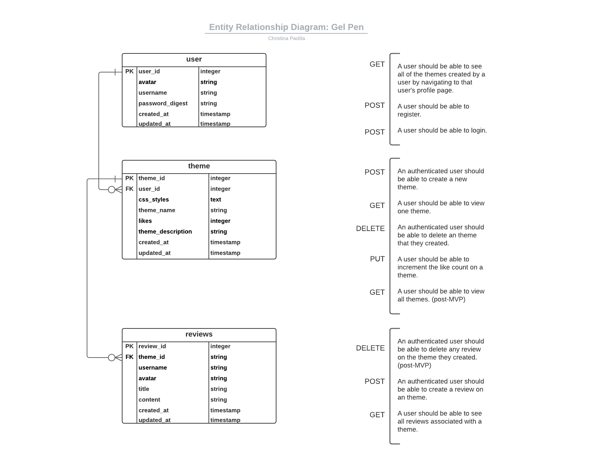
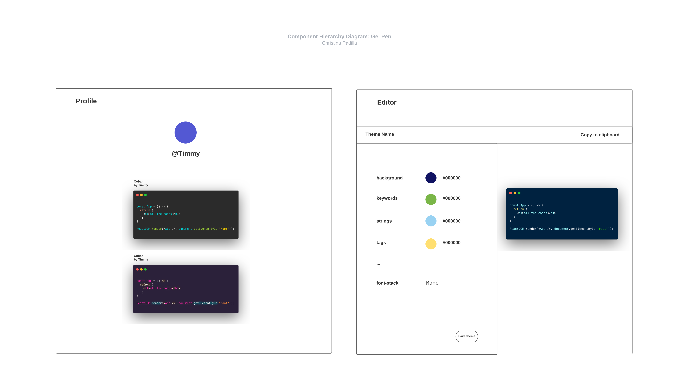
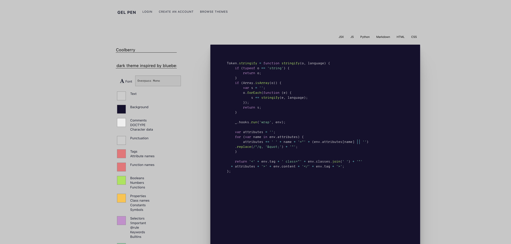

# Gel Pen 

## Project status: In development
### By: Christina Padilla

### [Portfolio](https://christinapadilla.com) | [GitHub](https://github.com/hipstina) | [LinkedIn](https://linkedin.com/in/hipstina)
***

### **Description** 
Gel Pen is an app for building beautiful syntax highlighting themes. With the Gel Pen editor, you can mock up your own syntax highlighting theme from scratch and begin using your theme immediately for all of your code snippets. Browse our library of themes to see what other users have made, like your favorites, and leave reviews of ones you've used.  

### **Technologies Used**
* React.js
* Flask-SQLAlchemy
* Redux


### **Getting Started**
To get started, clone this repo to your local machine.
```shell
$ git clone https://github.com/hipstina/gel-pen.git
```

This project is built with [Prism.js](https://prismjs.com/). You will need to install Prism.js power your syntax highlighting themes.
```shell
$ npm i prismjs
```


Install the dependencies for the server
```shell
$ cd gel-pen
$ npm i 
```

Install the dependencies for client
```shell
$ cd client
$ npm i
```

### **Screenshots**








### **Future Updates**
Track the development of this project on Trello: https://trello.com/b/LyINHY6A/gel-pen


### **Credits**

[Prism.js](https://prismjs.com/)

[Night Owl](https://github.com/sdras/night-owl-vscode-theme) - a VS code theme by Sarah Drasner 

[CSS Variables for React Devs](https://www.joshwcomeau.com/css/css-variables-for-react-devs/) by Josh Comeau

Diagrams & wireframe built with [Lucid](https://lucid.app/)
